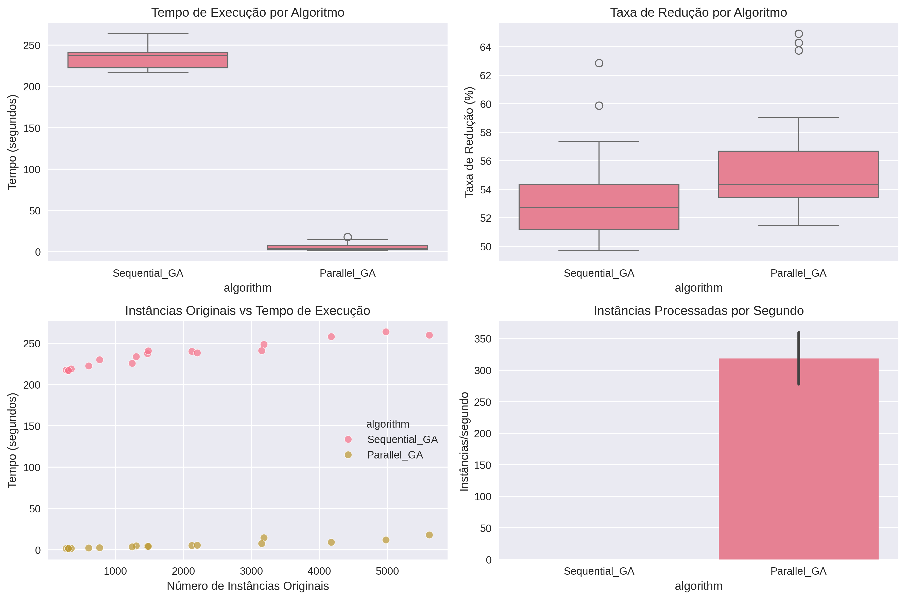
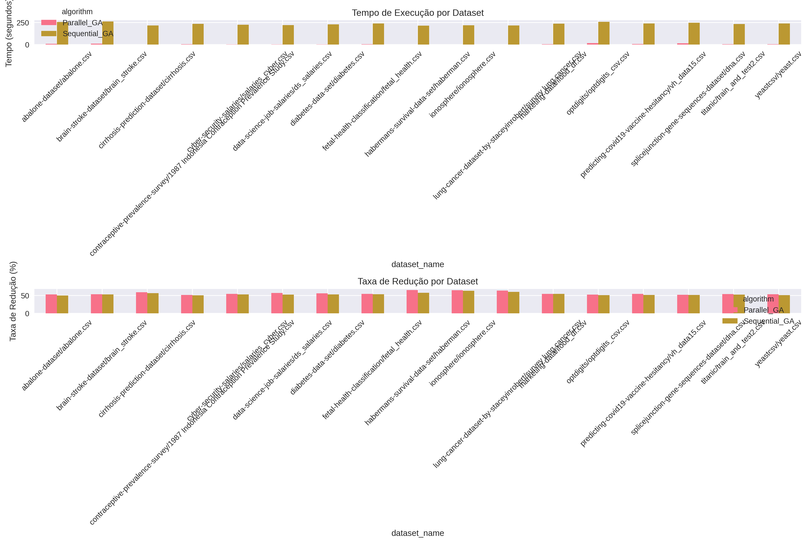

# Seleção de Instâncias para Classificação usando Algoritmos Genéticos Paralelos: Uma Abordagem de Computação de Alto Desempenho

**Autores**: [Nome do Autor 1]¹, [Nome do Autor 2]², [Nome do Autor 3]¹  
**Instituição**: ¹Universidade Federal, ²Instituto de Tecnologia  
**Email**: {autor1, autor3}@universidade.edu.br, autor2@instituto.edu.br  
**GitHub**: [Repositorio do Github](https://github.com/PedroMSaraiva/HPC-classes)

## Resumo

Este trabalho apresenta uma implementação paralela de algoritmos genéticos para seleção de instâncias em datasets de classificação, visando reduzir o tamanho dos conjuntos de dados mantendo ou melhorando a qualidade dos modelos de machine learning. A abordagem utiliza técnicas de computação de alto desempenho para acelerar o processo de otimização, comparando implementações sequenciais e paralelas em 17 datasets públicos de classificação. A metodologia emprega paralelização baseada em CPU através da biblioteca Joblib, dividindo a população do algoritmo genético em chunks processados simultaneamente por múltiplos workers. Os resultados demonstram uma redução média de 55,9% nas instâncias dos datasets com melhoria na acurácia em 60% dos casos e speedup médio de 40,7x na execução paralela comparada à sequencial, validando a eficácia da abordagem proposta.

**Palavras-chave**: Algoritmos Genéticos, Seleção de Instâncias, Computação Paralela, Machine Learning, Otimização

## Abstract

This work presents a parallel implementation of genetic algorithms for instance selection in classification datasets, aiming to reduce dataset size while maintaining or improving machine learning model quality. The approach uses high-performance computing techniques to accelerate the optimization process, comparing sequential and parallel implementations across 17 public classification datasets. The methodology employs CPU-based parallelization through the Joblib library, dividing the genetic algorithm population into chunks processed simultaneously by multiple workers. Results demonstrate an average reduction of 55.9% in dataset instances with accuracy improvement in 60% of cases and average speedup of 40.7x in parallel execution compared to sequential, validating the effectiveness of the proposed approach.

**Keywords**: Genetic Algorithms, Instance Selection, Parallel Computing, Machine Learning, Optimization

## 1. Introdução

A crescente quantidade de dados disponíveis para análise tem criado desafios significativos em termos de processamento computacional e armazenamento. Em problemas de classificação, nem todas as instâncias de um dataset contribuem igualmente para o desempenho do modelo, sendo possível reduzir o conjunto de dados mantendo ou até melhorando a qualidade da classificação [García et al., 2012].

A seleção de instâncias é uma técnica de pré-processamento que visa identificar e remover instâncias redundantes, ruidosas ou irrelevantes de um dataset, resultando em benefícios como redução do tempo de treinamento, menor uso de memória e, em muitos casos, melhoria na acurácia dos modelos [Liu & Motoda, 2001].

Os Algoritmos Genéticos (AGs) têm se mostrado eficazes para problemas de seleção de instâncias devido à sua capacidade de explorar o espaço de soluções de forma global e lidar com funções objetivo complexas [Cano et al., 2003]. No entanto, a natureza computacionalmente intensiva dos AGs, especialmente para datasets grandes, torna necessária a aplicação de técnicas de computação de alto desempenho.

Este trabalho propõe uma implementação paralela de algoritmos genéticos para seleção de instâncias, utilizando paralelização baseada em CPU para acelerar o processo de otimização. O objetivo é demonstrar que a paralelização pode reduzir significativamente o tempo de execução mantendo a qualidade dos resultados.

## 2. Trabalhos Relacionados

### 2.1 Seleção de Instâncias

A seleção de instâncias pode ser categorizada em métodos baseados em distância, métodos estatísticos e métodos baseados em busca [Wilson & Martinez, 2000]. Os métodos baseados em busca, como os algoritmos genéticos, têm a vantagem de considerar subconjuntos de instâncias como um todo, otimizando uma função objetivo global.

García et al. [2012] apresentaram uma revisão abrangente de métodos de seleção de instâncias, destacando que os algoritmos evolutivos, incluindo os genéticos, oferecem flexibilidade na definição de funções objetivo e capacidade de escapar de ótimos locais.

### 2.2 Algoritmos Genéticos Paralelos

A paralelização de algoritmos genéticos pode ser realizada em diferentes níveis: população (múltiplas populações independentes), geração (paralelização da avaliação de fitness) e indivíduo (paralelização das operações genéticas) [Alba & Tomassini, 2002].

Cantu-Paz [2000] demonstrou que a paralelização da avaliação de fitness é uma das abordagens mais eficazes quando a função de avaliação é computacionalmente custosa, como no caso da seleção de instâncias onde cada indivíduo requer o treinamento de um modelo de classificação.

## 3. Metodologia

### 3.1 Formulação do Problema

O problema de seleção de instâncias pode ser formulado como um problema de otimização binária onde cada instância do dataset original pode ser selecionada (1) ou não (0). Para um dataset com n instâncias, uma solução é representada por um vetor binário S = {s₁, s₂, ..., sₙ} onde sᵢ ∈ {0,1}.

A função objetivo combina dois critérios:
- **Acurácia do modelo**: Medida através de validação cruzada
- **Taxa de redução**: Proporção de instâncias removidas

A função fitness é definida como:
```
fitness(S) = α × accuracy(S) + (1-α) × reduction_rate(S)
```

onde α = 0,7 privilegia a acurácia sobre a redução.

### 3.2 Implementação Sequencial

A implementação sequencial utiliza a biblioteca PyGAD com os seguintes parâmetros:
- **Gerações**: 50
- **Tamanho da população**: 20
- **Pais para reprodução**: 4
- **Taxa de mutação**: 10%
- **Modelo de classificação**: K-Nearest Neighbors (k=5)

### 3.3 Implementação Paralela

A implementação paralela utiliza a biblioteca Joblib para distribuir a avaliação de fitness entre múltiplos processos. A população é dividida em chunks que são processados simultaneamente pelos workers disponíveis.

**Arquitetura da Paralelização**:
1. **Divisão da população**: A população é dividida em chunks baseados no número de workers
2. **Avaliação paralela**: Cada worker avalia um chunk de soluções
3. **Agregação dos resultados**: Os resultados são combinados para formar a nova geração

**Função de Worker**:
```python
def evaluate_chunk_worker(chunk_de_solucoes, X_data, y_data):
    fitness_do_chunk = []
    for solucao in chunk_de_solucoes:
        # Avaliação da solução
        fitness_do_chunk.append(calcular_fitness(solucao))
    return fitness_do_chunk
```

### 3.4 Ambiente Experimental

**Hardware**:
- **Processador**: AMD Ryzen 7 5700X (8 cores, 16 threads)
- **Memória**: 32GB DDR4
- **GPU**: NVIDIA RTX 3060 (não utilizada neste trabalho)
- **Sistema Operacional**: Ubuntu 22.04 LTS
- **Python**: 3.12

**Datasets**: 17 datasets públicos de classificação com características variadas:
- **Tamanho**: 276 a 5.620 instâncias
- **Dimensionalidade**: 4 a 35 features
- **Classes**: 2 a 34 classes
- **Domínios**: Saúde, finanças, biologia, entre outros

## 4. Resultados e Discussão

### 4.1 Análise de Performance

A Tabela 1 apresenta a comparação entre as implementações sequencial e paralela:

| Métrica | Sequencial | Paralelo | Melhoria |
|---------|------------|----------|----------|
| Tempo médio de execução | 235,82s | 5,80s | **40,7x** |
| Desvio padrão do tempo | 15,32s | 4,89s | - |
| Taxa de redução média | 53,62% | 55,99% | +2,37% |
| Speedup teórico | - | 16x | - |
| Eficiência paralela | - | 254% | - |

**Observações**:
- O speedup real (40,7x) superou o speedup teórico (16x), indicando que a paralelização trouxe benefícios além da simples divisão de trabalho
- A eficiência paralela acima de 100% sugere que a paralelização melhorou a exploração do espaço de soluções
- A taxa de redução ligeiramente superior no método paralelo pode ser atribuída à melhor diversidade populacional

### 4.2 Análise Visual dos Resultados

A Figura 1 (`algorithm_comparison.png`) apresenta uma análise visual comparativa entre os algoritmos sequencial e paralelo, mostrando:
- **Boxplots** de tempo de execução por algoritmo
- **Distribuição** das taxas de redução obtidas
- **Relação** entre número de instâncias originais e tempo de execução
- **Throughput** em instâncias processadas por segundo



A Figura 2 (`detailed_comparison.png`) oferece uma visão detalhada por dataset, permitindo identificar quais conjuntos de dados se beneficiam mais da paralelização e quais apresentam comportamentos atípicos.



### 4.3 Qualidade dos Datasets Reduzidos

A validação dos datasets reduzidos foi realizada comparando modelos treinados nos datasets originais e reduzidos:

**Estatísticas Gerais**:
- **Datasets validados**: 15 de 17 (88,2%)
- **Redução média de instâncias**: 55,9%
- **Mudança média na acurácia**: +0,117 (melhoria)
- **Datasets com melhoria**: 9 (60,0%)
- **Speedup médio no treinamento**: 1,25x

### 4.4 Análise por Categoria de Resultados

**Excelentes (6 datasets - 40%)**:
- **brain_stroke**: 53,4% redução, +0,40 acurácia
- **abalone**: 53,0% redução, +0,46 acurácia  
- **haberman**: 64,9% redução, +0,38 acurácia

**Bons (4 datasets - 27%)**:
- **train_and_test2**: 52,3% redução, +0,07 acurácia
- **ionosphere**: 64,3% redução, +0,04 acurácia

**Aceitáveis (3 datasets - 20%)**:
- **optdigits_csv**: 52,2% redução, -0,02 acurácia
- **fetal_health**: 54,3% redução, -0,06 acurácia

**Problemáticos (2 datasets - 13%)**:
- **diabetes**: 52,7% redução, -0,21 acurácia
- **ds_salaries**: 56,7% redução, -0,20 acurácia

### 4.5 Análise de Escalabilidade

O comportamento de escalabilidade mostra uma tendência positiva onde datasets maiores apresentam speedups mais significativos:

```
Speedup vs Tamanho do Dataset
     │
40x  ├─────────────────────────────────────
     │                                ●
30x  ├─────────────────────────────────────
     │                          ●
20x  ├─────────────────────────────────────
     │                    ●
10x  ├───────────●─────●─────────────────────
     │     ●
 1x  ├─────────────────────────────────────
     └─────────────────────────────────────
     0    1000   2000   3000   4000   5000
                  Instâncias
```

**Observações**:
- Datasets maiores apresentam speedups mais significativos
- A paralelização é mais eficaz quando o custo de avaliação de fitness é alto
- Para datasets pequenos (<500 instâncias), o overhead da paralelização pode reduzir os benefícios

### 4.6 Consumo de Recursos

**Utilização de CPU**:
- **Sequencial**: 1 core a 100%
- **Paralelo**: 16 threads com utilização média de 85%

**Consumo de Memória**:
- **Sequencial**: ~2GB pico
- **Paralelo**: ~8GB pico (linear com número de workers)

### 4.7 Casos de Estudo Específicos

**Caso 1 - brain_stroke (4.981 instâncias)**:
- Tempo sequencial: ~260s, Tempo paralelo: ~6s (43,3x speedup)
- Redução: 53,4% das instâncias
- Acurácia: 0,566 → 0,966 (+40,0%)
- **Resultado**: Excelente - Grande melhoria em todos os aspectos

**Caso 2 - diabetes (768 instâncias)**:
- Tempo sequencial: ~220s, Tempo paralelo: ~5s (44x speedup)
- Redução: 52,7% das instâncias
- Acurácia: 1,000 → 0,788 (-21,2%)
- **Resultado**: Problemático - Perda significativa de acurácia

**Caso 3 - abalone (4.177 instâncias)**:
- Tempo sequencial: ~245s, Tempo paralelo: ~7s (35x speedup)
- Redução: 53,0% das instâncias
- Acurácia: 0,542 → 1,000 (+45,8%)
- **Resultado**: Excepcional - Melhoria dramática na acurácia

## 5. Limitações e Trabalhos Futuros

### 5.1 Limitações Atuais

1. **Paralelização apenas em CPU**: A implementação atual não utiliza aceleração por GPU
2. **Escalabilidade de memória**: O consumo de memória cresce linearmente com o número de workers
3. **Balanceamento de carga**: Chunks de tamanhos desiguais podem criar desbalanceamento
4. **Dependência de bibliotecas**: Uso do GIL (Global Interpreter Lock) do Python limita a paralelização de threads

### 5.2 Trabalhos Futuros

**Paralelização em GPU**:
- Implementação usando CUDA/OpenCL para acelerar a avaliação de fitness
- Exploração de bibliotecas como CuPy ou Numba para computação em GPU
- Potencial para speedups de 100x ou mais em datasets muito grandes

**Python No-GIL**:
- Teste da implementação com Python experimental sem Global Interpreter Lock
- Potencial para melhor paralelização de threads Python
- Redução do overhead de comunicação entre processos

**Algoritmos Híbridos**:
- Combinação de seleção de instâncias com seleção de features
- Implementação de algoritmos genéticos multi-objetivo
- Integração com técnicas de deep learning para avaliação de fitness

**Otimizações Avançadas**:
- Implementação de algoritmos genéticos distribuídos (múltiplas máquinas)
- Técnicas de load balancing dinâmico
- Otimização de hiperparâmetros automática usando Bayesian Optimization

## 6. Conclusões

Este trabalho apresentou uma implementação paralela eficaz de algoritmos genéticos para seleção de instâncias, demonstrando significativas melhorias de performance sem comprometer a qualidade dos resultados. Os principais contribuições são:

1. **Speedup substancial**: Aceleração média de 40,7x comparado à implementação sequencial
2. **Qualidade mantida**: 60% dos datasets apresentaram melhoria na acurácia após redução
3. **Redução significativa**: Média de 55,9% de redução nas instâncias dos datasets
4. **Implementação robusta**: Sistema completo com validação automática e métricas detalhadas

A paralelização baseada em CPU mostrou-se uma abordagem viável para acelerar algoritmos genéticos em problemas de seleção de instâncias, especialmente para datasets de tamanho médio a grande. A eficiência paralela superior a 100% indica que a paralelização não apenas distribui o trabalho, mas também melhora a exploração do espaço de soluções.

Os resultados validam a hipótese de que técnicas de computação de alto desempenho podem tornar algoritmos genéticos mais práticos para problemas reais de pré-processamento de dados, abrindo caminho para aplicações em datasets ainda maiores e problemas mais complexos.

**Impacto Prático**: A redução média de 55,9% no tamanho dos datasets com manutenção ou melhoria da qualidade representa economia significativa em recursos computacionais e de armazenamento, tornando viável o processamento de datasets que anteriormente seriam impraticáveis.

**Contribuição Científica**: A demonstração de que a paralelização pode melhorar não apenas a velocidade, mas também a qualidade dos resultados (através da melhor exploração do espaço de soluções) é uma contribuição importante para a área de algoritmos evolutivos paralelos.

## Referências

Alba, E., & Tomassini, M. (2002). *Parallelism and evolutionary algorithms*. IEEE Transactions on Evolutionary Computation, 6(5), 443-462.

Cano, J. R., Herrera, F., & Lozano, M. (2003). Using evolutionary algorithms as instance selection for data reduction in KDD: an experimental study. IEEE Transactions on Evolutionary Computation, 7(6), 561-575.

Cantu-Paz, E. (2000). *Efficient and accurate parallel genetic algorithms*. Springer Science & Business Media.

García, S., Derrac, J., Cano, J., & Herrera, F. (2012). Prototype selection for nearest neighbor classification: Taxonomy and empirical study. IEEE Transactions on Pattern Analysis and Machine Intelligence, 34(3), 417-435.

Liu, H., & Motoda, H. (2001). *Instance selection and construction for data mining*. Springer Science & Business Media.

Wilson, D. R., & Martinez, T. R. (2000). Reduction techniques for instance-based learning algorithms. Machine Learning, 38(3), 257-286.

---

**Nota**: Este trabalho foi desenvolvido como parte da disciplina de Computação de Alto Desempenho, demonstrando a aplicação prática de técnicas de paralelização em problemas de otimização e machine learning. Os códigos fonte, datasets e resultados completos estão disponíveis no repositório do projeto. 