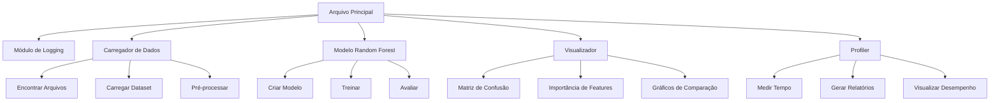
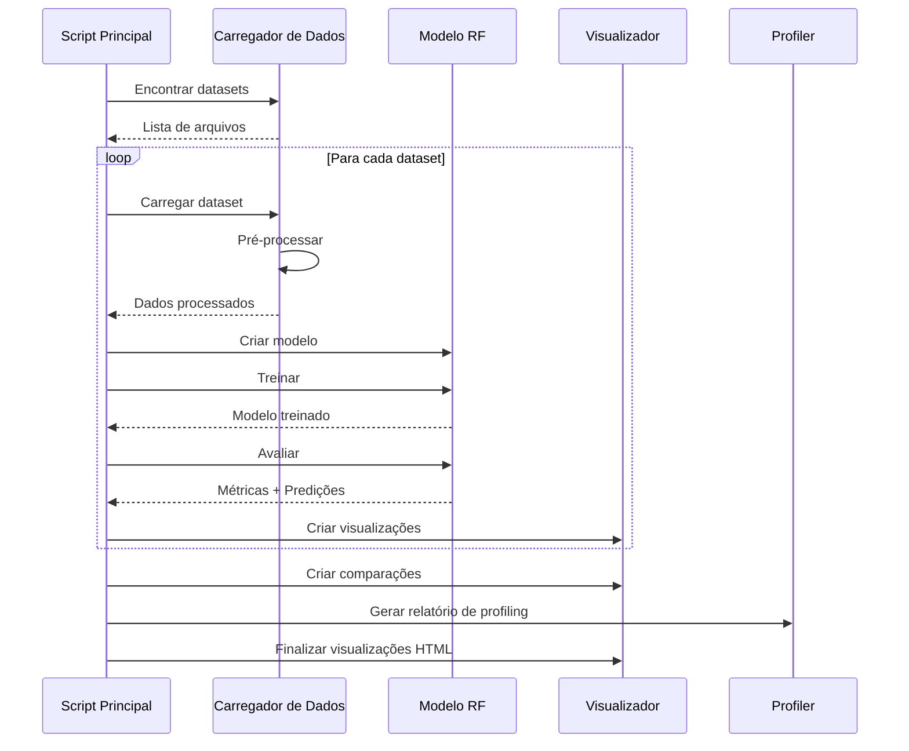
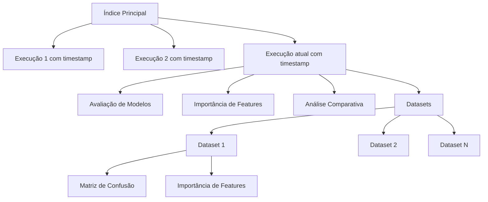

# Sistema Modular de Análise Random Forest 🌲

[](https://www.python.org/downloads/)
[](https://opensource.org/licenses/MIT)
[](https://scikit-learn.org/)
[](https://pandas.pydata.org/)
[](https://github.com/)

Este projeto implementa um sistema modular para análise de datasets usando algoritmos de Random Forest.
O sistema detecta automaticamente todos os datasets disponíveis, aplica pré-processamento adequado,
treina modelos Random Forest para classificação ou regressão, e gera relatórios e visualizações
detalhadas dos resultados com referência temporal.

## 📋 Índice

- [Características](#características)
- [Arquitetura do Sistema](#arquitetura-do-sistema)
- [Estrutura do Projeto](#estrutura-do-projeto)
- [Fluxo de Processamento](#fluxo-de-processamento)
- [Tecnologias Utilizadas](#tecnologias-utilizadas)
- [Instalação](#instalação)
- [Uso](#uso)
- [Organização das Visualizações](#organização-das-visualizações)
- [Customização](#customização)
- [Profiling de Tempo](#profiling-de-tempo)
- [Trabalho Realizado](#trabalho-realizado)
- [Próximos Passos](#próximos-passos)
- [Licença](#licença)

## ✨ Características

- **Design Modular**: Código organizado em módulos específicos para cada funcionalidade
- **Detecção Automática de Tarefa**: Identifica automaticamente se é um problema de classificação ou regressão
- **Análise Paralela**: Processa múltiplos datasets simultaneamente para maior eficiência
- **Visualizações Avançadas**: Gráficos interativos e informativos com referência temporal
- **Profiling de Desempenho**: Ferramentas para análise de tempo de execução e otimização
- **Interface Web Integrada**: Navegação fácil entre visualizações com HTML interativo
- **Rastreabilidade Temporal**: Todas as visualizações organizadas cronologicamente

## 🏗️ Arquitetura do Sistema

O sistema foi desenvolvido com uma arquitetura modular, separando as responsabilidades em componentes especializados:



## 📁 Estrutura do Projeto

```
trabalho-final/
├── run_random_forest.py         # Script principal
├── rf_modules/                  # Módulos do sistema
│   ├── __init__.py              # Inicialização do pacote
│   ├── data_loader.py           # Carregamento e processamento de dados
│   ├── logger_setup.py          # Configuração de logs
│   ├── model.py                 # Modelo Random Forest
│   ├── profiler.py              # Ferramentas de profiling
│   └── visualization.py         # Visualização de resultados
├── dataset/                     # Diretório para armazenar datasets
├── results/                     # Resultados da análise
│   ├── plots/                   # Gráficos organizados por execução
│   │   ├── AAAA-MM-DD_HH-MM-SS/ # Execução com timestamp
│   │   │   ├── model_evaluation/# Avaliação de modelos
│   │   │   ├── feature_importance/ # Importância de features
│   │   │   ├── comparative_analysis/ # Análises comparativas
│   │   │   └── datasets/       # Visualizações por dataset
│   │   └── index.html          # Índice HTML para navegação
│   └── profiling/               # Resultados de profiling
└── logs/                        # Arquivos de log
```

## 🔄 Fluxo de Processamento



## 🛠️ Tecnologias Utilizadas

- **Python 3.6+**: Linguagem principal
- **NumPy/Pandas**: Manipulação de dados
- **Scikit-learn**: Algoritmos de aprendizado de máquina
- **Matplotlib/Seaborn**: Visualização de dados
- **Numba**: Aceleração de código
- **Loguru**: Logging avançado
- **Multiprocessing**: Paralelização de tarefas

## 📥 Instalação

```bash
# Clonar o repositório
git clone <url-do-repositorio>
cd trabalho-final

# Instalar dependências
pip install -r requirements.txt
```

## 🚀 Uso

1. Execute o script `download_datasets.sh`
2. Arrume o seu ambiente local com `uv sync`(se usar uv) ou `pip install -r requirements.txt` em um .venv simples
3. Execute o script principal:

```bash
python run_random_forest.py

OU

uv run run_random_forest.py
```

4. Acesse os resultados:

- Abra o arquivo `results/visualizacoes.html` para navegar pelas visualizações
- Consulte `results/random_forest_summary.txt` para métricas detalhadas
- Explore `results/profiling/` para análise de desempenho

## 📊 Organização das Visualizações

O sistema organiza as visualizações em uma estrutura hierárquica com referência temporal:



Cada execução é organizada em uma pasta com timestamp único, facilitando a comparação de resultados ao longo do tempo.

## ⚙️ Customização

Você pode modificar os parâmetros do modelo editando as configurações no arquivo `run_random_forest.py` ou nos módulos específicos:

- **Número de árvores**: Altere `n_estimators` no módulo `model.py`
- **Parâmetros de visualização**: Configure estilos no módulo `visualization.py`
- **Paralelização**: Ajuste `NUM_WORKERS` em `run_random_forest.py`

## ⏱️ Profiling de Tempo

O sistema inclui ferramentas integradas para análise de desempenho:

- **Medição de tempo**: Para cada fase do processamento (carregamento, pré-processamento, treinamento)
- **Gráficos comparativos**: Visualize o tempo em diferentes datasets
- **Evolução temporal**: Acompanhe o desempenho ao longo de várias execuções

Os resultados de profiling são salvos em `results/profiling/` e incluem:

- Tempos médios de execução por função
- Série temporal de desempenho
- Detalhamento de chamadas de função

## 🏆 Trabalho Realizado

Este projeto implementou várias melhorias significativas em relação à versão original:

1. **Modularização completa do código**:

   - Separação de responsabilidades em módulos especializados
   - Criação de classes para encapsular funcionalidades relacionadas
   - Interfaces bem definidas entre componentes
2. **Sistema de visualização avançado**:

   - Organização cronológica das visualizações
   - Interface de navegação HTML interativa
   - Visualizações com referência temporal em múltiplos níveis
   - Gráficos aprimorados com informações detalhadas
3. **Ferramentas de profiling abrangentes**:

   - Medição de tempo para cada fase do processamento
   - Visualizações comparativas de desempenho
   - Suporte para análise em ambientes multiprocessados
4. **Melhorias na experiência do usuário**:

   - Relatórios mais detalhados e organizados
   - Melhor rastreabilidade de resultados
   - Facilidade de comparação entre datasets
   - Acesso simplificado às visualizações

## 🚧 Próximos Passos

Algumas melhorias e funcionalidades que podem ser implementadas no futuro:

1. **Expansão de algoritmos**:

   - Adicionar suporte a outros algoritmos de ML
   - Implementar comparação automática entre diferentes algoritmos
2. Seleção de Instancias e Colunas:

   - Criar algoritmo genetico/evolutivo de selecao de instancias e colunas
   - Modelagem do problema
3. Adicionar ativadades da telma

## 📄 Licença

Este projeto está licenciado sob a licença MIT - veja o arquivo LICENSE para mais detalhes.
